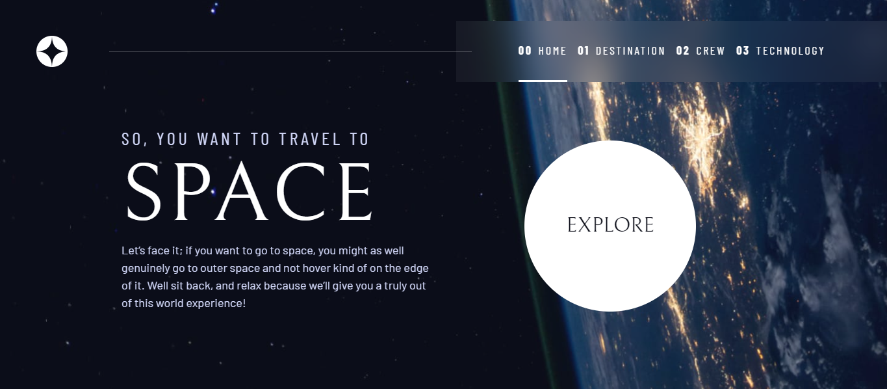

    <h1>Projeto Space Tourism</h1>
    
    
    
    
      
    
Projeto desafio do <i>site</i> <a href="https://www.frontendmentor.io/home" target="_blank">Frontend Mentor</a>, em parceria com o <a href="https://v2.scrimba.com/home" target="_blank">Scrimba</a>, no qual realizamos a construção de um <i>site</i> com a temática espacial.

## Tabela de conteúdos

- [Visão Geral](#visão-geral)
    - [Projeto](#projeto)
    - [Funcionamento](#funcionamento)
    - [Links](#links)
- [Processo de desenvolvimento](#processo-de-desenvolvimento)
    - [Construído com](#construído-com)
    - [O que aprendi](#o-que-aprendi)
    - [Aprimoramento contínuo](#aprimoramento-contínuo)
    - [Links úteis](#links-úteis)
- [Versões](#versões)
    - 1.0.0
    - 1.1.0
    - 1.2.0
    - 1.3.0
- [Autor](#autor)
- [Agradecimentos](#agradecimentos)

## Visão Geral

### Projeto

Usuários do projeto poderão:

- Visualizar o projeto em qualquer tamanho de tela, devido a sua responsividade
- Navegar por múltiplas páginas do *site*
- Explorar elementos interativos, melhorando a sua experiência
- Comprovar e experimentar a acessibilidade do projeto

### Funcionamento

Ao abrir o *site* tem-se a seguinte página, convidando-nos a explorá-lo através do botão *Explore*:

Ao clicar sobre o botão, somos levados a conhecer planetas e luas:

## Autor

- LinkedIn - [Hugo Moreira](https://www.linkedin.com/in/hugo-c%C3%A9sar-santos-moreira-a10823248/)
- GitHub - [@Hugo-Moreira91](https://github.com/Hugo-Moreira91)
- Frontend Mentor - [@Hugo-Moreira91](https://www.frontendmentor.io/profile/Hugo-Moreira91)

Sempre em busca de conhecimento 🚀

Feito com ❤️