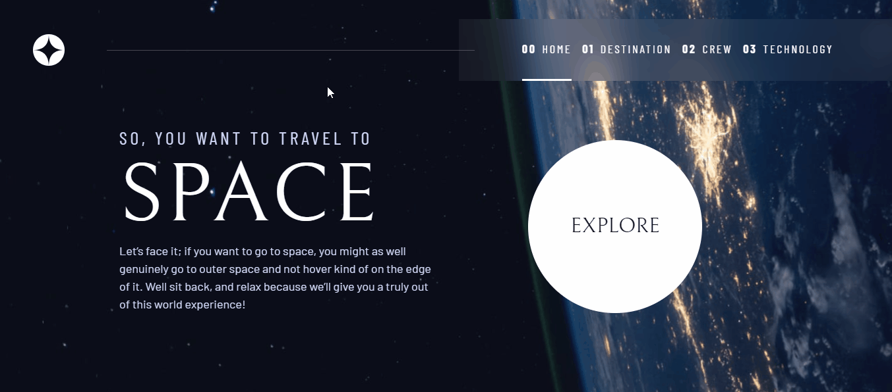

    <h1>Projeto Space Tourism</h1>
    
    
    
    
      
    
Projeto desafio do <i>site</i> <a href="https://www.frontendmentor.io/home" target="_blank">Frontend Mentor</a>, em parceria com o <a href="https://v2.scrimba.com/home" target="_blank">Scrimba</a>, no qual realizamos a construção de um <i>site</i> com a temática espacial.

## Tabela de conteúdos

- [Visão Geral](#visão-geral)
    - [Projeto](#projeto)
    - [Funcionamento](#funcionamento)
    - [Links](#links)
- [Processo de desenvolvimento](#processo-de-desenvolvimento)
    - [Construído com](#construído-com)
    - [O que aprendi](#o-que-aprendi)
    - [Aprimoramento contínuo](#aprimoramento-contínuo)
    - [Links úteis](#links-úteis)
- [Autor](#autor)
- [Agradecimentos](#agradecimentos)

## Visão Geral

### Projeto

Usuários do projeto poderão:

- Visualizar o projeto em qualquer tamanho de tela, devido a sua responsividade
- Navegar por múltiplas páginas do *site*
- Explorar elementos interativos, melhorando a sua experiência
- Comprovar e experimentar a acessibilidade do projeto

### Funcionamento

Ao abrir o *site* tem-se a seguinte página, convidando-nos a explorá-lo através do botão *Explore*:

Ao clicar sobre o botão, somos levados a conhecer planetas e luas. Nesta página, temos uma breve descrição dos astros, bem como sua distância e tempo estimado para alcançá-lo, tudo em relação ao planeta Terra:

Na página referente à tripulação, conhecemos um pouco sobre alguns integrantes:

Por fim, na página tecnologia, temos alguns dos artefatos utilizados para viajar no espaço:

### Links

- Endereço da solução: [Clique aqui para acessar o repositório do projeto](https://github.com/Hugo-Moreira91/space-tourism-project)
- Deploy: [Clique aqui para visualizar o projeto via GitHub Pages](https://hugo-moreira91.github.io/space-tourism-project/technology.html)

## Processo de desenvolvimento

### Construído com

- Marcações semânticas HTML5 para estruturação
- Propriedades CSS para estilização, separando-os em arquivos para melhor compreensão e manutenção 
- JavaScript para o menu principal de navegação, bem como para os botões internos das páginas
- Flexbox
- Grid layout
- Responsividade

### O que aprendi

- Uso consistente do grid, para posicionamento dos elementos nas páginas
- Criação de um menu de navegação principal
- Uso de propriedades CSS como *clamp*, *place-items*, *aspect-ratio*, *backdrop-filter* e *inset*
- Uso do atributo *hidden* no HTML
- Uso de atributos focados na acessibilidade
- Separação de funcionalidades no JavaScript
- Refatoração

### Aprimoramento contínuo

Alguns pontos que destaco:

- Criar mecanismos de acessibilidade, visando melhorar a experiência do usuário
- Separação de arquivos CSS para estilos correlatos, melhorando a consulta e manutenção
- Uso maior do grid para posicionamento dos elementos da página
- Melhorar a implementação do menu hamburguer para dispositivos mobile

### Links úteis

- [Página do desafio no *site* Frontend Mentor](https://www.frontendmentor.io/challenges/space-tourism-multipage-website-gRWj1URZ3) - Caso seja do interesse, basta realizar o *download* dos arquivos necessários para a realização do projeto, incluindo o arquivo Figma!
- ["Atacando" o projeto, com Kevin Powell](https://v2.scrimba.com/build-a-space-travel-website-c014) - está com dificuldades, ou deseja visualizar o desenvolvimento do projeto sob o olhar de um mestre do CSS, no *site* do Scrimba isso é possível! Acompanhe a construção de boa parte desse desafio com Kevin Powell.

## Autor

- LinkedIn - [Hugo Moreira](https://www.linkedin.com/in/hugo-c%C3%A9sar-santos-moreira-a10823248/)
- GitHub - [@Hugo-Moreira91](https://github.com/Hugo-Moreira91)
- Frontend Mentor - [@Hugo-Moreira91](https://www.frontendmentor.io/profile/Hugo-Moreira91)

Sempre em busca de conhecimento 🚀

Feito com ❤️

## Agradecimentos

Agradecer aos conhecimentos passados pelo Kevin Powell, ao Scrimba e ao Frontend Mentor. Ótimos desafios, para todos os níveis. 🫶🏼